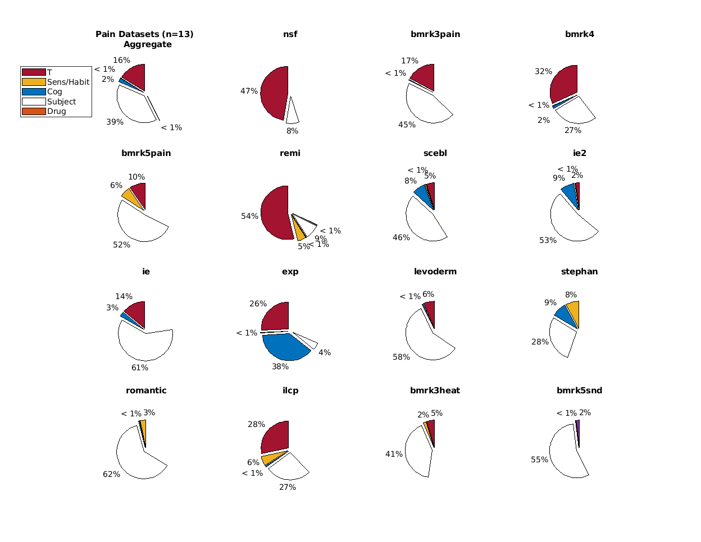

# CANLab Single Trials Repository 

This repository is designed for education and model and algorithm development for multivariate pattern analysis (MVPA) in Matlab. Its purpose is to provide access to a currated dataset in a homogenous format suitable for immediate MVPA applications.

This repository will download single trial data from the cloud if it is unavailable, and directly provides canlab_dataset objects with study metadata.

This repo also provides a set of convenience functions for loading and working with the single trials datasets (see "notable functions"), including several overloaded methods and classes designed as drop in replacements that will seemlessly integrate into the typical canlabCore workflow.

A simple demonstration of using this repo for MVPA algorithm development is illustrated in the [CANLab walkthrough script](https://canlab.github.io/_pages/canlab_single_trials_demo/demo_norming_comparison.html) at canlab.github.io.

Please note, some datasets available in house have not yet been made public, and you may see occasional references to these datasets. These datasets will be made available down the line, but if you wish to have access to them sooner, please contact Prof Tor D Wager. For the most part they are available upon request, fully currated, and consistently formated, but simply lack sufficient documentation for us to feel they're ready to be made public at this time. For a list of currently available public datasets see "Available fmri_data (or fmri_data_st) datasets" below.

## Data Overview
### Experimental factors affecting outcome measure (R2)
The figure below provides an overview of the effect of experimental factors on pain (or other outcome measures) for each dataset. Use this to select datasets appropriate to your applications (e.g. if you're interested in between subject effects, pick studies that show high subject variance). 

The models illustrated below estimate linear effects and subject means (fixed effects). Source [here](QC/QC_main.m). See the [published html](QC/html/QC_main.html) for details.

Caution: in the aggregated dataset analysis the "subjects" wedge includes dataset mean differences too since subjects and datasets are colinear. Do not naively assume it represents the mean of the individual dataset graphics.

## Setup 

Dependencies (add these to your path first, and ensure they're up to date)
- spm12
- CanlabCore (github.com/canlab/canlabCore)

Clone the repo, add it to your Matlab path. If single trial dataset are available, add those to your matlab path as well (otherwise they will be downloaded). 

If you have access to canlab_single_trials_private please also add that to your path and refer to the setup section of its README to complete installation.

Downloaded datasets come from the web and are automatically downloaded by our downloader method.

## Usage

Example:

data = load_image_set('bmrk4', 'md5check')

See "Available Datasets" subsection for dataset names. 

### Notable functions ###

class fmri_data_st\
Inherets fmri_data object and overloads methods to better handle specific attributes of single trial datasets (e.g. metadata_table fields). You can use the datasets as fmri_data objects but you will have an easier time if they're cast as fmri_data_st instead (automatically done if called using load_image_set, see below))
- fmri_data_st/cat
- fmri_data_st/get_wh_image
- fmri_data_st/mean

function fmri_data_st/quantileByY()\
will return a dataset averaged over *.Y quantiles (e.g. quartiles). Useful for prototyping. Working with single trials directly is very slow and will sap your productivity. Don't do it.

class cvpartition2\
Inherits matlabs cvpartition, and uses the same invocation but respects block membership groupings (e.g. subject identity) when the stratify argument is specified. Useful for cross validated estimates on single trial data (where subjects should belong to either test or training splits, but not both).

extends load_image_set()
- Support importing single trial datasets by name. (e.g. nsf = load_image_set('nsf')). 
- Auto converts datasets to type fmri_data_st.
- Auto downloads missing datasets (after user prompt). 
- Optional: md5 check
- support importing all datasets in a single fmri_data_st object: dat = load_image_set('all_single_trials');

### Available fmri_data (or fmri_data_st) datasets 
The following are available as fmri_data objects (cast to fmri_data_st objects if imported using load_image_set()). Use explicitly with load_image_set(). e.g. load_image_set('nsf')
- nsf
- bmrk3pain
- bmrk3warm
- bmrk4
- exp
- ie
- ie2
- ilcp
- romantic
- scebl
- stephan

single trial fmri_data objects have,
- all trials (including non-response trials with nan entries), unmodified, taken from single trials google drive
- magnitude ratings (pain, heat or sound intensity for bmrk5) in fmri_data.Y field
- description of fmri_data.Y in fmri_data.Y_descrip
- trial metadata (e.g. cues, stimulus intensity, or other manipulations) in fmri_data.metadata_table field
- Relevant citations in fmri_data.additional_info.references
- source notes indicating where img and metadata were found (disambiguating where needed, e.g. bmrk4_smoothed_withbasis is indicated in source_notes for bmrk4).
- are subdivided by stimulus modality (e.g. bmrk3)

### Available canlab_dataset objects
\*Notice that dataset objects are not subdivided by modality.
- nsf
- bmrk3*
- bmrk4
- exp
- ie
- ie2
- ilcp
- romantic
- scebl
- stephan

dataset objects have,
- all relevant experimental variables, coded in a consistent fashion across studies
- coding scheme descriptions for any esoteric entries (e.g. 'reveal' in stephan placebo)
- dataset references to cite
- for IE and IE2 there's age, gender, race and handedness information Subject Level information
- all data was checked for sensible experimental effects using mixed models.

### Using private datasets ###

If approved for access to a private dataset you can access it using functions provided by this library. You will need

- the URL to the file (which anybody with access to private repo can offer you, by inspecting datasets/brain/download_dataset.m therein)
- an md5 checksum (optional)
- a decryption key, &lt;decriptionKey&gt;
- the *dataset_obj.mat data of behavioral data (optional, anybody with access to the private repo can get you this, they're in datasets/behavior/ therein)

Download the dataset file to &lt;downloadedFilePath&gt;
run,
decrypt_dataset(&lt;downloadedFilePath&gt;, &lt;decryptedFilePath&gt;, 'key', &lt;decryptionKey&gt;);

Check md5 if you like however you would normally do that. The file can now be imported into matlab using 
data = importdata(&lt;decryptedFilePath&gt;);

The result is an fmri_data_st object identical to what load_image_set provides for public datasets. The metadata_table property will provide all the same trial level information provided by the *dataset_obj.mat file, but if you want subject or study level information the dataset_obj file may be useful.

## References

Please refer to the \*.additional_info.references field of each fmri_data object (i.e. each dataset) for appropriate references pertaining to said dataset. Please cite these references if using these datasets in your own work.

Additionally, we would appreciate being notified of any new publications which use this work. Prof Tor Wager can currently best be reached via his institutional email at Dartmouth College.

## Troubleshooting

Please contact [Bogdan Petre]( https://github.com/bogpetre ) for help with technical issues related to this repository.
